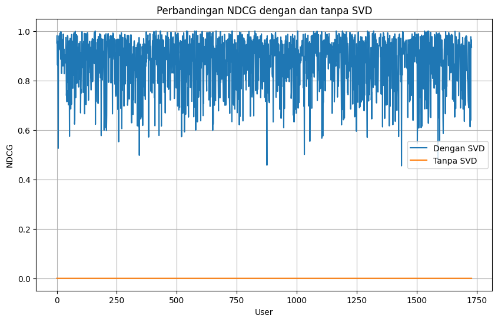

# Laporan Proyek Machine Learning (Sistem Rekomendasi) - Maulidhan Ady Nugraha

## Domain Proyek

### Film sebagai Hiburan Utama  
Pada era digital ini, film menjadi salah satu media hiburan yang digemari oleh masyarakat dari berbagai kalangan. Dengan hadirnya platform streaming seperti *Netflix*, penonton kini memiliki akses mudah ke ribuan judul film dari berbagai genre dan negara, kapan saja dan di mana saja.

### Pentingnya Sistem Rekomendasi  
Dengan begitu banyaknya pilihan film, *user* sering kali mengalami kesulitan dalam menemukan film yang sesuai dengan preferensi mereka. Untuk mengatasi hal ini, sistem rekomendasi digunakan sebagai alat untuk menyarankan film yang relevan berdasarkan data preferensi *user* atau pola perilaku mereka.

### Sistem Rekomendasi sebagai Solusi  
Sistem rekomendasi dapat dibangun menggunakan berbagai pendekatan, seperti *content-based filtering*, *collaborative filtering*, atau kombinasi keduanya. Pendekatan *collaborative filtering* berbasis *user* (UB) sering digunakan karena kemampuannya untuk memberikan rekomendasi yang personal. Teknik ini memanfaatkan pola rating dari *user* lain dengan preferensi serupa untuk memprediksi rekomendasi.

### Tantangan: Masalah Sparsity  
Salah satu tantangan utama dalam membangun sistem rekomendasi adalah masalah *sparsity*, yaitu kondisi di mana matriks *user-item* memiliki banyak sel kosong akibat kurangnya data rating. Hal ini dapat menurunkan akurasi prediksi karena sistem tidak memiliki cukup informasi untuk menganalisis preferensi *user*.

### Tantangan: Masalah Scalability  
Masalah *scalability* menjadi tantangan signifikan dalam sistem rekomendasi seiring dengan meningkatnya jumlah *user* dan item. Matriks interaksi *user-item* yang sangat besar dapat menyebabkan kebutuhan penyimpanan dan komputasi yang tinggi, membuat algoritma rekomendasi tradisional sulit untuk berfungsi secara efisien. Sistem sering kali menghadapi kendala dalam memberikan hasil rekomendasi secara real-time karena proses penghitungan kesamaan antar *user* atau antar item memerlukan sumber daya komputasi yang besar.

### Solusi Sparsity dan Scalability: Pendekatan SVD+UB  
Pendekatan *Singular Value Decomposition* (SVD) dalam kombinasi dengan metode *user-based filtering* (UB) telah terbukti efektif mengatasi masalah *sparsity*. SVD memfaktorkan matriks *user-item* menjadi matriks dengan dimensi yang lebih kecil, memungkinkan identifikasi pola tersembunyi dalam data. Penelitian menunjukkan bahwa metode ini meningkatkan akurasi prediksi dan mempercepat proses rekomendasi, terutama pada dataset besar seperti *MovieLens*. Sebagai contoh:  
- Mhammedi et al. (2023) dalam jurnal *Bulletin of Electrical Engineering and Informatics* menyajikan metode SVD berbasis ontologi yang efektif dalam menangani *sparsity* ([Lihat Jurnal](https://www.researchgate.net/publication/369376824))  
- Penelitian lain pada konferensi *ICICS 2018* juga mendiskusikan penerapan SVD dalam sistem *collaborative filtering*, menunjukkan peningkatan kinerja sistem rekomendasi ([Baca Detailnya di Sini](https://www.researchgate.net/publication/328385118))  

## Business Understanding  

Masalah *sparsity* terjadi ketika matriks interaksi *user-item* sebagian besar kosong akibat keterbatasan rating yang diberikan *user* pada sejumlah kecil item. Hal ini sering dijumpai pada platform dengan katalog besar, seperti layanan streaming atau *e-commerce*, di mana hanya sebagian kecil konten yang dievaluasi oleh *user*. Akibatnya, sistem rekomendasi tidak memiliki cukup data untuk memahami preferensi *user* dengan baik.

*Scalability* dalam sistem rekomendasi merujuk pada kemampuan sistem untuk menangani volume data yang terus berkembang, baik itu jumlah *user*, item, maupun interaksi *user-item*, tanpa mengurangi kecepatan dan akurasi rekomendasi. Ketika jumlah data meningkat, sistem harus tetap efisien dalam memproses informasi dan memberikan rekomendasi yang relevan secara real-time. Tantangan *scalability* mencakup peningkatan kebutuhan komputasi, penyimpanan, dan waktu pemrosesan, yang dapat mempengaruhi performa sistem jika tidak dioptimalkan dengan baik. Teknik optimasi seperti *distributed computing*, dekomposisi matriks, dan model berbasis *deep learning* sering digunakan untuk mengatasi masalah ini.

*Sparsity* dan *scalability* berdampak negatif pada kualitas rekomendasi karena membatasi kemampuan algoritma untuk mengidentifikasi pola perilaku *user* atau kesamaan antar item. Pada *user-based collaborative filtering* (UB), sistem kesulitan menemukan *user* dengan preferensi serupa, sedangkan pada *item-based filtering* (IB), kesamaan antar item menjadi sulit untuk ditentukan. Hasilnya, rekomendasi yang dihasilkan cenderung kurang relevan, menurunkan kepuasan *user*, dan berpotensi mengurangi tingkat konversi atau pendapatan.

Untuk mengatasi *sparsity* dan *scalability*, teknik seperti SVD telah terbukti efektif. SVD mengurangi dimensi matriks interaksi dengan mengidentifikasi pola laten dalam data, memungkinkan sistem menghasilkan prediksi yang lebih akurat meskipun data yang tersedia terbatas. Selain SVD, ada solusi lain yaitu dengan cara mengurangi dimensi data dengan *user*-*user* yang dianggap mampu mewakili dalam hal merekomendasikan film. Solusi ini membantu meningkatkan relevansi rekomendasi, yang pada gilirannya meningkatkan pengalaman *user* dan kinerja bisnis.

### Problem Statements

Penyataan yang terjadi dari penjelasan di atas adalah:  
- *Sparsity* sebagai masalah utama dalam sebuah sistem rekomendasi karena terjadi kekosongan data yang cukup tinggi persentasenya. Bagaimana cara mengatasinya?  
- *Scalability* juga menjadi tantangan tersendiri dalam sebuah sistem rekomendasi

### Goals

Tujuan dari proyek ini adalah:  
- Menyelesaikan masalah *sparsity* pada sistem rekomendasi dengan teknik yang telah teruji.  
- Menyelesaikan masalah *scalability* pada sistem rekomendasi dengan teknik yang telah teruji.

### Solution Statements  
- Solusi yang ditawarkan adalah dengan membuat sebuah sistem rancangan kinerja yang baik dengan menggunakan algoritma SVD+UB.  
- Solusi yang ditawarkan adalah dengan menyeleksi *user* yang dianggap mampu mewakili dalam hal merekomendasikan film.

## Data Understanding
Data yang digunakan adalah data review film dari *Netflix* dan daftar film yang bisa diunduh pada link berikut [Data Rating Film](https://archive.ics.uci.edu/ml/datasets/Restaurant+%26+consumer+data). Data berisi *User_ID*, *Rating*, *Movie_ID*, *Year*, dan *Name*. Jumlah rating sebanyak 17 juta dengan rating dari 1-5.
  

### Variabel-variabel pada *Reviews Film Netflix* dataset adalah sebagai berikut:
- *User_ID*: Berisi ID *user* yang telah memberikan rating terhadap film
- *Rating*: Nilai rating antara 1-5
- *Movie_ID*: Berisi ID dari film yang dirating
- *Year*: Tahun rilis film
- *Name*: Judul film    

**Mehami Data**:
- Menggunakan `df.isnull().sum()` untuk mengecek apakah ada data yang kosong
- Menggunakan `pd.Series(df["User_ID"].unique()).sort_values()` untuk mengecek jumlah *user*
- Menggunakan `pd.Series(df["Movie_ID"].unique()).sort_values()` untuk mengecek jumlah film
- Menghitung persentase *sparsity* data tersebut

## Data Preparation
Untuk memperoleh data yang baik maka diperlukan beberapa tahap sebelum melakukan proses *modelling*. Berikut beberapa tahapan yang dilakukan

**Rubrik/Kriteria Tambahan (Opsional)**:
- Melakukan seleksi terhadap *user* yang telah mereview lebih dari sama dengan 400 film 
- Melakukan pembagian data (80% Data *Training* dan 20% Data *Testing*) menggunakan `train_test_split`

## Modeling

Metode yang digunakan untuk menyelesaikan masalah *sparsity* dan *scalability* adalah dengan menggunakan metode *SVD+UB*. Metode ini akan dibandingkan dengan metode UB (tanpa SVD). Tujuannya adalah untuk melihat apakah *SVD* dapat menyelesaikan masalah *sparsity* dan *scalability*.

*SVD* digunakan untuk memprediksi preferensi *user* berdasarkan matriks interaksi, seperti matriks rating yang menunjukkan seberapa suka *user* terhadap item tertentu. Proses *SVD* memecah matriks rating menjadi tiga matriks: matriks *user* (*U*), matriks item (*Vt*), dan matriks diagonal nilai singular yang menggambarkan kekuatan hubungan antara *user* dan item. Dengan memfaktorkan matriks ini, *SVD* memungkinkan sistem untuk menangkap pola tersembunyi, seperti kesamaan preferensi antar *user* atau antar item, sehingga dapat memprediksi rating yang belum diberikan dan menghasilkan rekomendasi yang lebih akurat. Teknik ini juga sering digunakan dalam pendekatan *collaborative filtering* ([Koren, 2008](https://doi.org/10.1145/1289913.1289918); [Chen & Zhao, 2014](https://doi.org/10.4236/jsea.2014.710087)).

**Kelebihan SVD**: 

- **Reduksi Dimensi**  
  *SVD* mereduksi dimensi data besar dengan mempertahankan informasi penting, sehingga meningkatkan efisiensi perhitungan.

- **Menangkap Pola Tersembunyi**  
  *SVD* dapat menemukan hubungan tersembunyi antar *user* dan item, meningkatkan akurasi rekomendasi.

- **Menangani Data Sparse**  
  *SVD* efektif mengisi kekosongan pada matriks sparse, memprediksi rating yang hilang berdasarkan pola yang ada. 

Pemilihan metode *SVD* didasarkan pada penelitian sebelumnya yang menyatakan bahwa masalah *sparsity* dan *scalability* dapat diselesaikan dengan metode *SVD* ([Zhou et al., 2017](https://ieeexplore.ieee.org/document/8325026)).

## Evaluation

Matriks yang digunakan untuk membandingkan kinerja dari kedua skenario tersebut adalah matriks *NDCG*. Matriks *NDCG* adalah matriks yang menghitung akurasi dari rekomendasi yang dihasilkan oleh kedua skenario. Semakin tinggi nilai *NDCG*-nya, maka semakin baik metode yang digunakan.

**Hasil NDCG**:

  
*Gambar 1.1*

Pada Gambar 1.1 dapat dilihat bahwa garis biru menunjukkan nilai *NDCG* metode *SVD+UB*, sedangkan garis orange menunjukkan nilai *NDCG* metode UB (tanpa *SVD*). Dapat dilihat bahwa di semua user yang memperoleh rekomendasi, metode *SVD+UB* memiliki nilai *NDCG* yang lebih baik dibandingkan dengan UB (tanpa *SVD*). Hal ini menunjukkan bahwa *SVD* mampu menyelesaikan masalah *sparsity* dan *scalability*.

**Hasil Rekomendasi**

Dengan menggunakan skenario yang berbeda dan menghasilkan nilai NDCG yang berbeda tentunya menghasilkan rekomendasi yang berbeda pula. Hasil dari rekomendasi dapat dilihat pada Gambar 1.2.

  
*Gambar 1.2*

Dapat dilihat bahwa tidak ada satupun rekomendasi film yang sama untuk *user* dengan *User_ID* 1333. Dengan melihat hasil NDCG pada Gambar 1.1 tetntunya rekomendasi yang dihasilkan dengan menggunakan *SVD+UB* lebih baik untuk digunakan.

### Cara Metrik Bekerja

*NDCG* (Normalized Discounted Cumulative Gain) adalah metrik evaluasi yang digunakan untuk menilai kualitas urutan hasil pencarian atau rekomendasi berdasarkan relevansi item terhadap query atau preferensi *user*. Cara kerjanya adalah sebagai berikut:

1. **Cumulative Gain (CG)**: Menghitung total relevansi hasil pencarian berdasarkan urutan item. Semakin relevan item, semakin tinggi nilai CG.
   
2. **Discounted Cumulative Gain (DCG)**: Memberikan "diskon" atau penurunan nilai relevansi untuk item yang muncul di posisi lebih bawah dalam daftar. Hal ini karena hasil yang muncul lebih tinggi dianggap lebih penting. Rumus *DCG* biasanya mengalikan relevansi item dengan faktor diskonto (sering kali menggunakan logaritma dari posisi item).

3. **Normalized DCG (NDCG)**: Untuk menghindari bias terhadap panjang daftar atau dataset tertentu, *NDCG* membandingkan nilai *DCG* yang diperoleh dengan nilai ideal *DCG* (IDCG), yaitu *DCG* yang dihasilkan jika hasil pencarian diurutkan dengan relevansi tertinggi. *NDCG* dihitung sebagai:

  
*Gambar 1.3*

   Di mana \( k \) adalah posisi pada daftar hasil yang ingin dievaluasi. Nilai *NDCG* berkisar antara 0 dan 1, di mana 1 menunjukkan hasil yang optimal.

## Referensi

1. Mhammedi, S., et al. (2023). *A highly scalable CF recommendation system using ontology and SVD-based methods*. [ResearchGate](https://www.researchgate.net/publication/369376824)
2. *Applying SVD in collaborative filtering recommendation systems*. *2018 9th International Conference on Information and Communication Systems (ICICS)*. [ResearchGate](https://www.researchgate.net/publication/328385118)
3. Koren, Y. (2008). *Factorization meets the neighborhood: A multifaceted collaborative filtering model*. ACM Transactions on Knowledge Discovery from Data (TKDD), 4(1), 1-19. [DOI](https://doi.org/10.1145/1289913.1289918)
4. Chen, C., & Zhao, D. (2014). *A survey of recommender systems based on matrix factorization methods*. Journal of Software Engineering and Applications, 7(10), 815-821. [DOI](https://doi.org/10.4236/jsea.2014.710087)
5. Zhou, D., Jin, R., & Yang, X. (2017). Incremental singular value decomposition-based collaborative filtering recommendation algorithm. Proceedings of the International Conference on Data Science, 145-155. [IEEE](https://ieeexplore.ieee.org/document/8325026)

